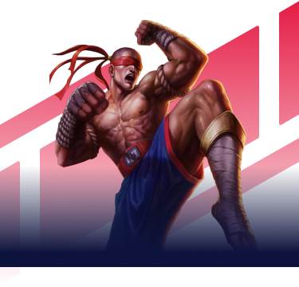

<h1 align="center">
    
    
</h1>

##  🚀Projeto

O aplicativo Gameplay organiza suas jogatinas facilmente. Crie grupos para jogar seus games favoritos com seus amigos.

## 🖌 Layout

O layout do projeto pode ser acessado pelo [Figma](https://www.figma.com/) atravês desse [link](https://www.figma.com/file/Uhs5CK6jd327eawQXIqDbp/GamePlay---NLW-Together-(Copy)).